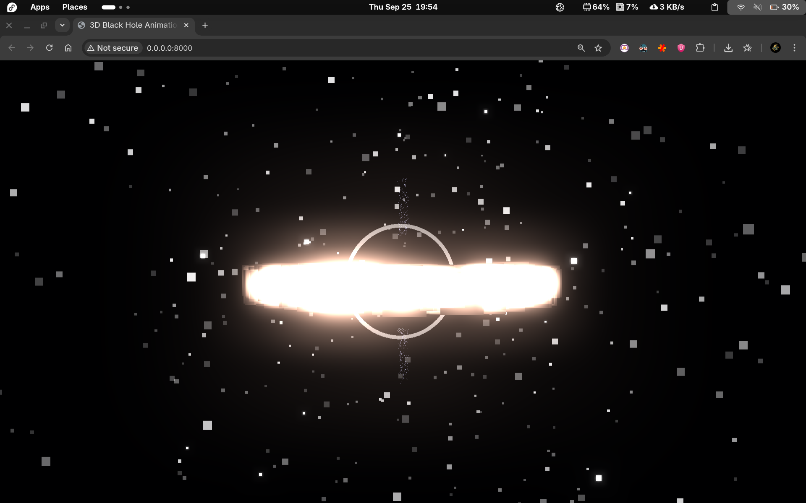

# 3D Black Hole Animation

## Description

This project is a real-time interactive 3D animation of a stylized black hole, built using [Three.js](https://threejs.org/) and TypeScript. It simulates key astrophysical phenomena including the event horizon, photon sphere, accretion disk, relativistic jets, and a surrounding starfield. The visualization incorporates gravitational lensing effects, bloom post-processing, and GPU-accelerated particle physics for realistic motion and performance.

The animation is optimized for both desktop and mobile devices, with touch-friendly controls and responsive rendering.

## Features

- **Interactive Black Hole Visualization**: A shader-based event horizon with rim lighting, gravitational redshift, and photon sphere glow.
- **Accretion Disk Simulation**: 2000 GPU-accelerated particles orbiting the black hole, with temperature-based coloring (using Kelvin-to-RGB conversion) and orbital mechanics.
- **Relativistic Jet Streams**: Bipolar particle jets emanating from the poles, simulating relativistic outflows.
- **Infinite Starfield**: Level-of-Detail (LOD) system with up to 8000 stars, dynamically adjusting based on camera distance for performance.
- **Post-Processing Effects**: Unreal Bloom for glowing effects and a custom shader pass for gravitational lensing.
- **Mobile Optimizations**: Responsive canvas sizing, touch controls via [OrbitControls](https://threejs.org/docs/#examples/en/controls/OrbitControls), and WebGL performance tweaks (e.g., antialiasing disabled on high-DPI devices).
- **Fallback Support**: CPU-based physics for non-WebGL2 environments.
- **Subtle Animations**: Slow rotation of the starfield and turbulent motion in the accretion disk for immersion.

## Screenshots



## Installation

1. Clone the repository (if not already local):
   ```
   git clone <repository-url>
   cd 3D-Black-Hole-Animation
   ```

2. Install dependencies:
   ```
   npm install
   ```

This installs Three.js, TypeScript, and type definitions.

## Usage

### Quick Start (Development Server)

1. Build the TypeScript code:
   ```
   npm run build
   ```
   This compiles [`src/script.ts`](src/script.ts) to [`dist/script.js`](dist/script.js).

2. Start the local server:
   ```
   npm run serve
   ```
   Opens a simple HTTP server on `http://localhost:8000`.

3. Open `http://localhost:8000` in your browser. The animation loads automatically in [`index.html`](index.html).

### Direct Usage

- Open [`index.html`](index.html) directly in a modern browser (Chrome, Firefox, Safari recommended for WebGL2 support).
- No build step needed if using the pre-compiled `dist/script.js`.

### Controls

- **Mouse/Touch Drag**: Rotate the view around the black hole (OrbitControls).
- **Mouse Wheel / Two-Finger Pinch**: Zoom in/out.
- **Right-Click Drag / Two-Finger Pan**: Pan the camera.
- Full 360° rotation and unlimited zoom (min 0.1, max ~2M units).

On mobile, the canvas is full-screen with touch gestures enabled.

## Technical Architecture

The project uses a Three.js scene graph with custom shaders and GPU computation for efficiency.

### Core Components

- **Scene Setup** ([`src/script.ts`](src/script.ts:666-853)): 
  - Perspective camera positioned for optimal viewing (adjusted for mobile).
  - WebGLRenderer with mobile optimizations (e.g., `powerPreference: 'high-performance'`).
  - EffectComposer for post-processing pipeline.

- **Black Hole Mesh** ([`createBlackHole`](src/script.ts:44-141)):
  - Sphere geometry with custom vertex/fragment shaders.
  - Event horizon (pure black), photon sphere glow, redshift effects, and disk grazing illumination.
  - Uniforms for time-based animation.

- **Accretion Disk** ([`createAccretionDisk`](src/script.ts:186-319)):
  - 2000 particles with positions, velocities, colors, and temperatures.
  - GPUComputationRenderer for physics (orbital gravity, turbulence) using compute shaders ([`positionComputeShader`](src/script.ts:322-362), [`velocityComputeShader`](src/script.ts:364-384)).
  - Fallback to CPU Euler integration if WebGL2 unavailable.
  - Shader-based rendering with Doppler shift approximation.

- **Photon Sphere** ([`createPhotonSphere`](src/script.ts:386-395)): Torus geometry with additive blending for glow.

- **Jet Streams** ([`createJetStreams`](src/script.ts:397-488)):
  - 1000 particles with linear acceleration along poles.
  - GPU compute shaders ([`jetPositionComputeShader`](src/script.ts:490-508), [`jetVelocityComputeShader`](src/script.ts:510-524)).
  - CPU fallback for vertical motion.

- **Starfield** ([`createStarField`](src/script.ts:532-643), [`updateStarField`](src/script.ts:645-663)):
  - LOD system: Low (1500 stars, dist >100), Medium (4000, >50), High (8000, close).
  - Seeded random distribution for consistency.
  - Subtle rotation for parallax effect.

- **Post-Processing**:
  - RenderPass → Custom Lensing Shader (ray-marching approximation for bending) → UnrealBloomPass.
  - Lensing simulates light deflection near the event horizon.

- **Physics and Animation** ([`animate`](src/script.ts:954-969)):
  - 60FPS loop with controls update, GPU computes, and uniform updates.
  - Responsive resize handler ([`onWindowResize`](src/script.ts:971-982)).

### Build Configuration

- TypeScript compilation via [`tsconfig.json`](tsconfig.json): Targets ES2020, outputs to `dist/`.
- Import maps in [`index.html`](index.html) for ES modules from unpkg (avoids local bundling).

## Dependencies

- **Runtime**: 
  - `three@^0.162.0` - Core 3D library.

- **Development**:
  - `@types/three@^0.162.0` - TypeScript definitions.
  - `typescript@^5.5.0` - Compiler.

See [`package.json`](package.json) for full details.

## Build and Development

### Scripts

- `npm run build`: Compile TS to JS (`tsc`).
- `npm run dev`: Watch mode for development (`tsc --watch`).
- `npm run serve`: Start HTTP server (`python -m http.server 8000`).

### Development Workflow

1. Edit [`src/script.ts`](src/script.ts).
2. Run `npm run dev` for auto-recompilation.
3. Serve and refresh browser.
4. For production, run `npm run build` and deploy `index.html` + `dist/script.js`.

TypeScript strict mode is enabled for type safety.

## Contributing

Contributions are welcome! Please:

1. Fork the repository.
2. Create a feature branch (`git checkout -b feature/amazing-feature`).
3. Commit changes (`git commit -m 'Add amazing feature'`).
4. Push to the branch (`git push origin feature/amazing-feature`).
5. Open a Pull Request.

Ensure code follows the existing style (e.g., shader uniforms, particle counts) and test on mobile/desktop.

## License

This project is licensed under the ISC License - see the [LICENSE](LICENSE) file (or add one if missing) for details.

---

*Built with ❤️ for astrophysics enthusiasts. Explore the cosmos!*